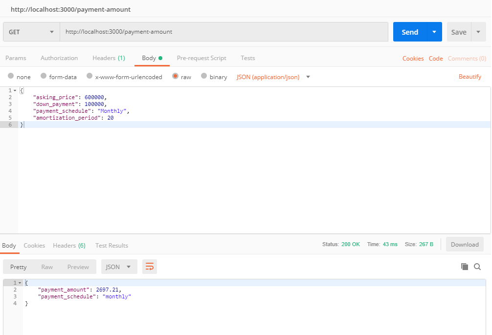

# Mortgage Calculator API
Calculates recurring mortgage payments and maximum mortgages<br>
API accepts and returns JSON only
Implemented using Express.js and Node.js <br>
Tested using Express.js version 4.14.0, Node.js version 10.15.3, and Postman chrome extension <br>
Download and install npm/Node.js here: https://www.npmjs.com/get-npm

### Setup: <br>
```Clone the repository and navigate to the workspace``` <br>
```npm install``` <br>
```node index.js``` <br>

App is set to run at http://localhost:3000

### Methods: <br>
#### GET /payment-amount <br>
Get the recurring payment amount of a mortgage <br>
Example JSON: {"asking_price": 700000, "down_payment": 200000, "payment_schedule": "weekly", "amortization_period": 10} <br>
Params:<br>
Asking Price<br>
Down Payment`*`<br>
Payment schedule`***`<br>
Amortization Period`**`

Return:<br>
Payment amount per scheduled payment

#### GET /mortgage-amount <br>
Get the maximum mortgage amount <br>
Example JSON: {"payment_amount": 700000, "down_payment": 200000, "payment_schedule": "weekly", "amortization_period": 10} <br>
Params:<br>
payment amount<br>
Down Payment(optional)`****`<br>
Payment schedule`***`<br>
Amortization Period`**`<br>

Return:<br>
Maximum Mortgage that can be taken out

#### PATCH /interest-rate <br>
Change the interest rate used by the application <br>
Example JSON: {"interest_rate": 5} <br>
Params: <br>
Interest Rate (% from 0 to 100) <br>

Return:<br>
Message indicating the old and new interest rate

`*` Must be at least 5% of first $500k plus 10% of any amount above $500k (So $50k on a $750k
mortgage) <br>
`**` Min 5 years, max 25 years <br>
`***` Weekly, biweekly, monthly <br>
`****` If included its value should be added to the maximum mortgage returned <br>

### Important Information:
Mortgage interest rate is initialized to 2.5% per year

Mortgage insurance is required on all mortgages with less than 20% down. Insurance must be <br>
calculated and added to the mortgage principal. Mortgage insurance is not available for <br>
mortgages > $1 million.

Mortgage insurance rates are as follows: <br>
Down payment Insurance Cost <br>
5-9.99% 3.15% <br>
10-14.99% 2.4% <br>
15%-19.99% 1.8% <br>
20%+ N/A <br>
Payment formula: P = L[c(1 + c)^n]/[(1 + c)^n - 1] <br>
P = Payment <br>
L = Loan Principal <br>
c = Interest Rate

### Postman GET /payment-amount example:



Created by Cody Coombes
